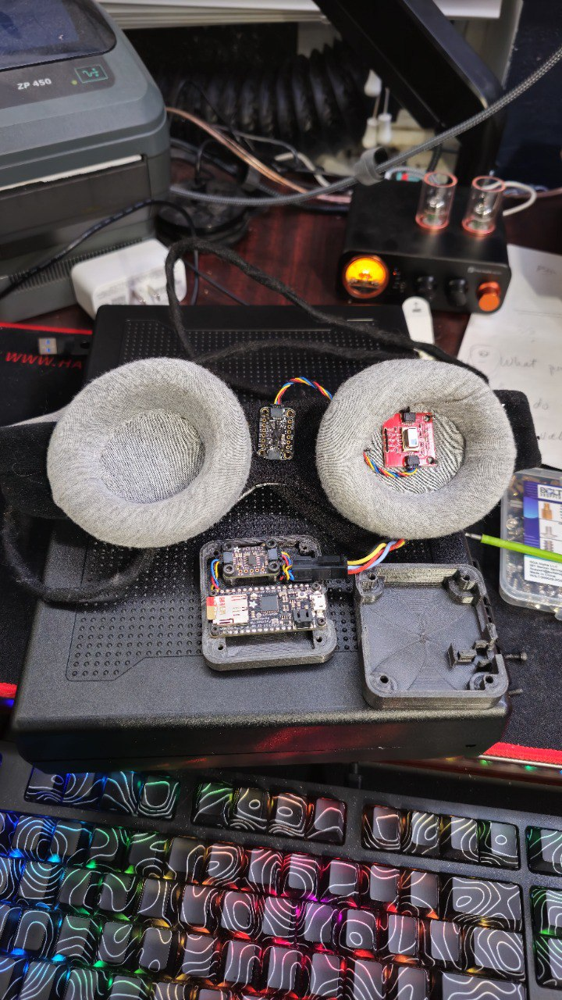
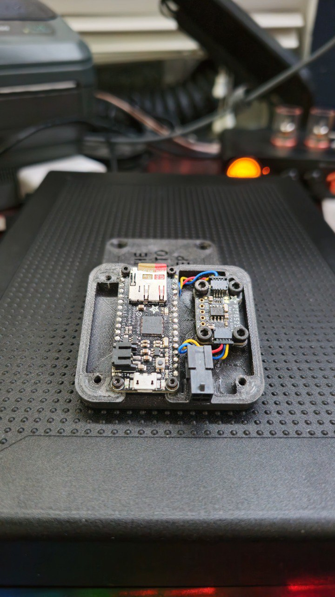
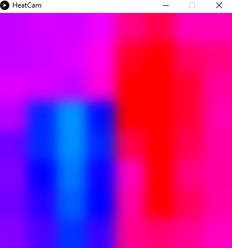
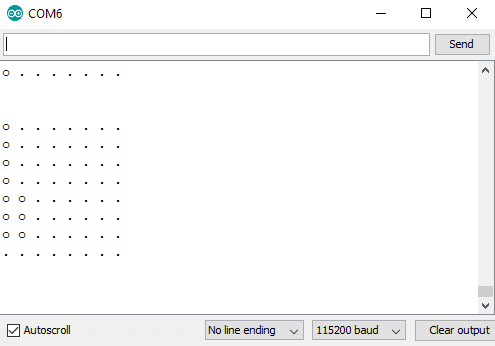
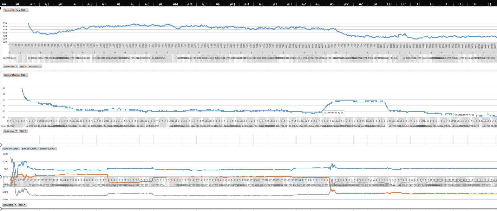

# REM Logger: Non-Contact Sleep Tracker

*Figure 1: The finished REM Logger wearable mask assembly.*

*Figure 2: Internal view of the Adafruit Feather M0 logger and sensor wiring.*

## Overview
REM Logger is a wearable embedded system designed to detect REM (Rapid Eye Movement) sleep phases without invasive EEG electrodes. The project utilizes a novel sensor fusion approach, combining thermal imaging with accelerometry to infer sleep stages based on physiological markers.

## Problem Statement
Traditional sleep tracking (polysomnography) requires cumbersome wiring and electrodes, interfering with natural sleep. Consumer wearables often rely solely on heart rate and wrist movement, which can lack precision in distinguishing specific sleep stages like REM.

## Engineering Solution
This device is a custom-sewn eye mask integrating a microcontroller and sensor array designed to monitor two key REM indicators:
1.  **Rapid Eye Movement**: Detected via a **Grid-EYE Thermopile Array (8x8)**. The sensor measures the infrared radiation delta. As the eye moves, the apex (cornea) distance to the sensor changes, creating a detectable thermal signature.
2.  **Sleep Paralysis (Atonia)**: Detected via an **Accelerometer**. During REM, the body enters a state of temporary paralysis (atonia), meaning head movement should be near zero.

### Theory of Operation: IR Thermopile & Black Body Radiation
The eye-tracking mechanism relies on the principles of **Black Body Radiation**. Every object with a temperature above absolute zero emits infrared radiation. 
-   **Stefan-Boltzmann Law**: The sensor (AMG8833) detects the intensity of IR radiation, which is proportional to the fourth power of the object's absolute temperature ($P \propto T^4$).
-   **Distance Sensitivity**: While the cornea and the surrounding eyelid are at similar biological temperatures, the cornea's distinct shape (the "apex") and its movement create a dynamic change in the IR flux hitting the individual pixels of the 8x8 thermopile array.
-   **Non-Invasive & Passive Detection**: Unlike **Time-of-Flight (ToF)** sensors, which are *active* and must emit infrared light pulses to measure distance, the thermopile is a *passive* sensor. It detects naturally occurring radiation emitted by the body. This is a critical design choice for a sleep tracker, as it ensures zero light-bleed or electronic emission that could interfere with the user's circadian rhythm or sleep quality.
-   **EMF Safety**: By relying on passive thermal signatures, the device avoids placing active emitters (which can generate electromagnetic fields or heat) directly against the sensitive ocular region.

### Design for Comfort & Wearability
To ensure the device could be worn through the night:
-   **Anatomical Design**: A **Manta Sleep Mask** was selected as the base chassis specifically for its **offset eye cups**. This provided the necessary cavity around the eye socket to prevent pressure on the eyelids during REM while maintaining the sensors at an optimal, fixed distance from the cornea.
-   **Material Selection**: **Tesa tape** was utilized for all surfaces touching the face or body. This soft, fleece-like tape provided superior comfort and prevented skin irritation during long-duration sleep sessions.

## System Architecture
### Hardware
-   **Adafruit Feather M0 Adalogger**: Main microcontroller with integrated SD logging capabilities.
-   **AMG8833 Grid-EYE Sensor**: 8x8 IR thermopile array for eye-tracking.
-   **LIS3DH Accelerometer**: 3-axis motion tracking for atonia detection.
-   **PCF8523 RTC**: High-precision Real-Time Clock for timestamp synchronization.
-   **Custom 3D-Printed Case**: Lightweight enclosure for the Feather M0 and battery.

### Firmware & Features
-   **Signal Filtering**: Implements both Exponential Moving Average (EMA) and Simple Moving Average (SMA) to reduce sensor noise.
-   **Gravity Compensation**: Advanced normalization logic to isolate intentional head movements from static gravitational pull.
-   **Automatic Log Rotation**: Incremental file naming to prevent data loss across multiple sessions.
-   **Startup Delay**: 60-second warm-up window to allow sensors to calibrate before data acquisition begins.

## Analysis & Visualization
The project employed a multi-stage analysis pipeline to validate sensor data and detect sleep patterns:

*Figure 3: Real-time thermal visualization using Processing (Java). The 8x8 grid represents the IR intensity delta across the eye socket.*

*Figure 4: High-frequency data stream visualization during sensor calibration.*

*Figure 5: Post-hoc data analysis using Excel Pivot Tables to correlate movement and thermal variance over an 8-hour session.*

## Data Validation & Results
Analysis of an 8-hour sleep session demonstrated the viability of this non-invasive approach. 
-   **Session Duration**: 7.89 Hours
-   **Data Points**: ~356,000 samples
-   **REM Detection**: Approximately **13.4%** of the session was identified as "REM-like" (High Eye Activity + Sleep Paralysis), correlating well with expected human sleep cycles (typically 20-25%).

*Note: The `Acc. Norm` (Normalized Acceleration) metric proved critical in filtering out "false positives" where head movement caused thermal variance.*

## Repository Structure
-   `/src/firmware`: Modernized Arduino C++ source code.
-   `/src/analysis`: Processing sketches for data visualization.
-   `/hardware`: 3D CAD files (SolidWorks/STL) for the enclosure.
-   `/data/samples`: Sample datasets from sleep tracking sessions.

--- 
*Project Status: Archived / Prototype*